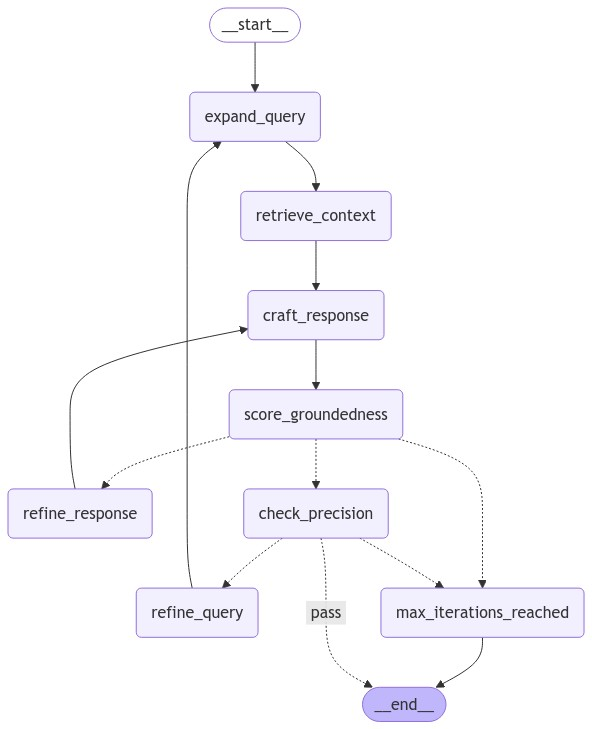

# 🥗 NutriCare AI - Intelligent Nutrition Disorder Specialist

NutriCare AI is an advanced AI-powered nutrition consultation system that leverages cutting-edge Retrieval-Augmented Generation (RAG) technology to provide personalized, evidence-based nutritional guidance for various health conditions. The system combines sophisticated query processing, memory management, and response validation to deliver accurate and contextually relevant nutrition advice.

## 🏗️ High-Level Architecture

The NutriCare AI system follows a sophisticated multi-stage pipeline designed to ensure accurate, relevant, and grounded responses:


### System Architecture Overview

```
┌───────────────────────────────────────────────────────────────────────┐
│                           NutriCare AI System                         │
├───────────────────────────────────────────────────────────────────────┤
│  Frontend Layer                                                       │
│  ┌─────────────────┐  ┌─────────────────┐  ┌─────────────────────┐    │
│  │   Streamlit UI  │  │   Rate Limiter  │  │     Safeguards      │    │
│  │ - Chat Interface│  │ - IP Tracking   │  │ - LlamaGuard        │    │
│  │ - User Login    │  │ - Usage Stats   │  │ - Content Filter    │    │
│  └─────────────────┘  └─────────────────┘  └─────────────────────┘    │
├───────────────────────────────────────────────────────────────────────┤
│  AI Processing Layer                                                  │
│  ┌─────────────────┐  ┌─────────────────┐  ┌─────────────────────┐    │
│  │ Query Processor │  │ResponseGenerator│  │     Evaluators      │    │
│  │ - Expansion     │  │ - LangChain     │  │ - Groundedness      │    │
│  │ - Refinement    │  │ - OpenAI GPT    │  │ - Precision         │    │
│  └─────────────────┘  └─────────────────┘  └─────────────────────┘    │
├───────────────────────────────────────────────────────────────────────┤
│  Knowledge & Memory Layer                                             │
│  ┌─────────────────┐  ┌─────────────────┐  ┌─────────────────────┐    │
│  │    ChromaDB     │  │      Mem0       │  │     LlamaParse      │    │
│  │ - Vector Store  │  │ - User Memory   │  │ - PDF Parser        │    │
│  │ - Embeddings    │  │ - Context       │  │ - Documents         │    │
│  └─────────────────┘  └─────────────────┘  └─────────────────────┘    │
├───────────────────────────────────────────────────────────────────────┤
│  Infrastructure Layer                                                 │
│  ┌─────────────────┐  ┌─────────────────┐  ┌─────────────────────┐    │
│  │     Logging     │  │   Environment   │  │    File System      │    │
│  │ - App Logs      │  │ - API Keys      │  │ - Rate Data         │    │
│  │ - Error Track   │  │ - Config        │  │ - Temp Files        │    │
│  └─────────────────┘  └─────────────────┘  └─────────────────────┘    │
└───────────────────────────────────────────────────────────────────────┘
```
### Document Extraction
Document extraction to ChromaDB is handled in the Jupyter notebook: [document_extraction.ipynb](notebooks/data_extraction/document_extraction.ipynb)

This notebook contains the complete pipeline for:
- PDF document parsing using LlamaParse
- Text chunking and preprocessing
- Vector embedding generation
- ChromaDB storage and indexing
### Core Processing Flow



1. **Query Expansion** → Enhances user queries to improve retrieval accuracy
2. **Context Retrieval** → Fetches relevant documents from vector store
3. **Response Generation** → Crafts responses based on retrieved context
4. **Groundedness Evaluation** → Validates factual alignment with context
5. **Precision Evaluation** → Scores response relevance to user query
6. **Response Refinement** → Improves gaps and ambiguities if needed
7. **Query Refinement** → Enhances search precision for future iterations

## 🚀 Key Features

- **Memory-Enhanced Conversations**: Persistent user context and preference tracking
- **Evidence-Based Recommendations**: RAG technology with verified nutritional sources
- **Advanced Query Processing**: Multi-stage query expansion and refinement
- **Content Safety**: Integrated guardrails and content filtering
- **Usage Analytics**: IP-based rate limiting and usage tracking
- **Real-time Processing**: Streamlit-based interactive interface

## 🛠️ Technology Stack

### Core AI Framework
- **LangChain**: AI orchestration and workflow management
- **OpenAI GPT-4**: Large language model for response generation
- **ChromaDB**: Vector database for document storage and retrieval
- **Mem0**: Conversation memory and context management

### Document Processing
- **LlamaParse**: Advanced PDF parsing with table extraction
- **Sentence Transformers**: Text embedding generation
- **OpenAI Embeddings**: `text-embedding-ada-002` for semantic search

### Infrastructure & Security
- **Rate Limiting**: IP-based request throttling
- **Content Filtering**: LlamaGuard integration for safety
- **Environment Management**: Python virtual environments
- **Logging**: Comprehensive application monitoring

## 🧬 Advanced LLM Techniques

### 1. Query Expansion
Enhancing user queries to improve retrieval accuracy without altering the original intent. This step ensures that the user's queries are refined to capture the most relevant information from the extensive nutritional resources.

**Implementation:**
- Semantic query enhancement
- Context-aware keyword expansion

### 2. Context Retrieval
Fetching relevant documents from a vector store based on the expanded or original query. This step is crucial to provide contextually relevant information that the model can use to generate accurate responses.

**Features:**
- Semantic similarity search
- Cross-encoder reranking
- Contextual compression
- Self-query retrieval

### 3. Response Generation
Crafting accurate and informative responses strictly adhering to the retrieved context. This ensures that the AI provides information directly from the trusted nutritional sources, maintaining reliability and relevance.

**Techniques:**
- Context-aware generation
- Template-based responses
- Nutritional expertise prompting
- Empathetic communication patterns

### 4. Groundedness Evaluation
Assessing the factual alignment of the generated response with the retrieved context. This step ensures that the responses generated by the AI are factually correct and based on the provided context, enhancing the credibility of the information.

**Validation Methods:**
- Factual consistency checking
- Source attribution validation
- Context adherence scoring
- Hallucination detection

### 5. Precision Evaluation
Scoring the precision of the response in addressing the user's query. This step evaluates how well the response addresses the specific query of the user, ensuring relevance and usefulness.

**Metrics:**
- Query-response alignment
- Relevance scoring
- Completeness assessment
- User intent satisfaction

### 6. Response Refinement
Providing constructive feedback to improve gaps, ambiguities, or missing details in the response. If the response does not meet the groundedness or precision criteria, it is refined to ensure it meets the required standards.

**Refinement Process:**
- Gap identification
- Ambiguity resolution
- Detail enhancement
- Clarity improvement

### 7. Query Refinement
Suggesting improvements for the expanded query to enhance search precision. If the response needs further improvement, the query itself is refined to ensure better retrieval in subsequent iterations.

**Optimization Strategies:**
- Search term optimization
- Query restructuring
- Context incorporation
- Feedback-driven refinement

### 8. Safeguards
Implementing comprehensive safety measures to ensure appropriate, safe, and responsible AI interactions. This critical layer protects users from harmful content and ensures the system operates within ethical boundaries.

**Safety Mechanisms:**
- **LlamaGuard Integration**: Pre-trained content moderation model that filters inappropriate inputs and outputs
- **Input Validation**: Real-time screening of user queries for harmful or inappropriate content
- **Output Filtering**: Post-generation review to ensure responses meet safety standards
- **Medical Boundary Enforcement**: Clear limitations on medical advice scope
- **Inappropriate Content Blocking**: Automatic detection and prevention of unsafe content categories
- **Context-Aware Safety**: Dynamic safety checking based on conversation context
- **Escalation Protocols**: Graceful handling of edge cases and boundary violations

**Safety Categories Monitored:**
- Harmful medical advice
- Inappropriate content (S1-S13 categories)
- Misinformation prevention
- Professional boundary maintenance
- Age-appropriate content filtering

## 📋 System Requirements

### Environment Setup
```bash
# Python 3.9.6 with virtual environment
python3 -m venv .venv
source .venv/bin/activate

# Install dependencies
pip install -r requirements.txt
```

### Required API Keys
- `OPENAI_API_KEY`: OpenAI GPT and embedding models
- `GROQ_API_KEY`: Groq API for additional processing
- `MEM0_API_KEY`: Memory management service

### Usage Limits
- **Hourly Limit**: 10 requests per IP address
- **Daily Limit**: 25 requests per IP address
- **Automatic Reset**: Limits reset hourly/daily

## 🚦 Getting Started

### 1. Installation
```bash
git clone <repository-url>
cd nutri_care_ai
source .venv/bin/activate
pip install -r requirements.txt
```

### 2. Environment Configuration
```bash
# Create .env file with required API keys
cp .env.example .env
# Edit .env with your API keys
```

### 3. Run the Application
```bash
streamlit run app.py
```

### 4. Access the Interface
- Open your browser to `http://localhost:8501`
- Enter your name to begin a session
- Start asking nutrition-related questions

## 💡 Usage Examples

### Sample Queries
- "What should I eat for iron deficiency?"
- "Help me plan meals for diabetes management"
- "What foods should I avoid with high cholesterol?"
- "Suggest a balanced diet for weight management"
- "What are the best sources of protein for vegetarians?"

### Best Practices
- Be specific about your health conditions
- Mention dietary restrictions or preferences
- Ask follow-up questions for clarification
- Provide context about your current diet

## 🔒 Safety & Compliance

### Content Safety
- **LlamaGuard Integration**: Filters inappropriate content
- **Medical Disclaimer**: Provides general guidance only
- **Professional Consultation**: Recommends healthcare professional consultation

### Data Privacy
- **IP-based Tracking**: No personal data storage
- **Session Management**: Temporary conversation memory
- **Secure Processing**: Environment-based API key management

## 📊 Monitoring & Analytics

### Logging System
- Comprehensive application logging
- User interaction tracking
- Error monitoring and reporting
- Performance metrics collection

### Rate Limiting
- IP-based request throttling
- Usage statistics display
- Automatic limit enforcement
- Fair access controls

## 🤝 Contributing

We welcome contributions to NutriCare AI! Please read our contributing guidelines and submit pull requests for any improvements.


## ⚠️ Medical Disclaimer

**Important**: NutriCare AI provides general nutritional guidance only and is not a substitute for professional medical advice, diagnosis, or treatment. Always consult qualified healthcare professionals for medical concerns and before making significant dietary changes.
